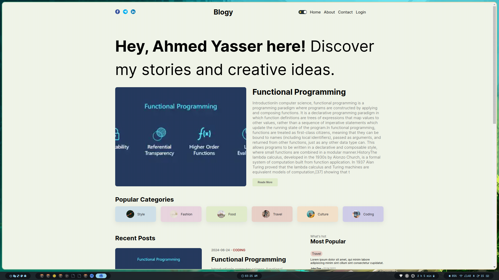
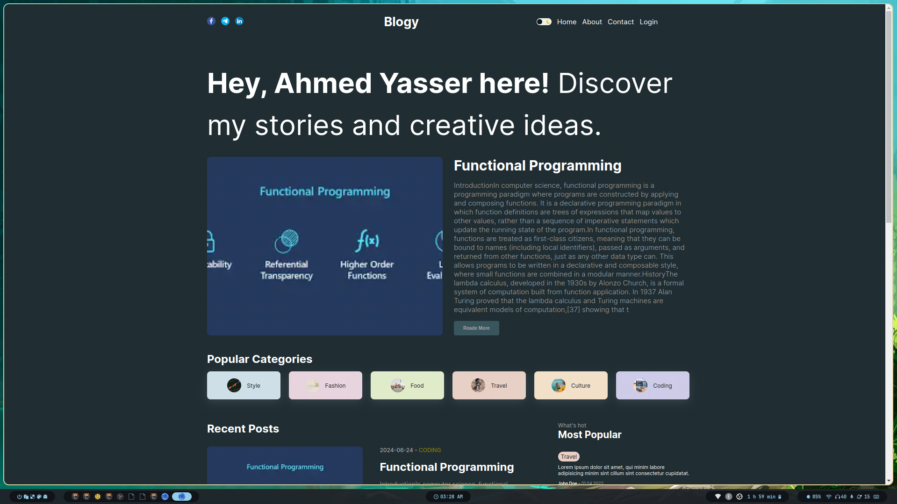

# Blogy

Blogy is a simple blog applications written in next.js.




## Features

1. Create a post
2. Show all posts
3. Show a single post
4. Show posts under a category
5. Add a comment to a post
6. Show all comments of a post
7. Login and logout
8. Register a new user
9. Show most popular post

## Tech Stack

1. Next.js
2. Postgres
3. TypeScipt
4. NextAuth.js
5. Docker
6. Firebase

## How to run

1. Clone the repo

```bash
git clone https://github.com/ahmedYasserM/blogy.git
```

2. Install dependencies

```bash
cd blogy
npm install
```

3. Create a `.env` file in the root directory and add the following

```
NEXTAUTH_URL = http://localhost:3000
NEXTAUTH_SECRET = mySecret

DATABASE_HOST = localhost
DATABASE_USER = postgres
DATABASE_PASSWORD = postgres
DATABASE_NAME = blogy

GOOGLE_ID =  `your google id`
GOOGLE_SECRET = `your google secret`
```

> - to get a GOOGLE_ID and GOOGLE_SECRET check [this](https://analytify.io/get-google-client-id-and-client-secret/)

4. Enable firebase storage to store images

1. Go [to](https://console.firebase.google.com/)
1. Create a new project (we do not want google analytics so you can uncheck it)
1. Select the new project
1. Click on the web icon to add a web app
1. Enter the app name and click on register app
1. Copy the firebaseConfig object
1. Replace the content of `src/utils/firebase.ts` with the copied object and export the app instance in the last line of the file

1. Run a postgres database image using docker compose

from the root directory run

```bash
docker compose up -d
```

6. Run the app

```bash
npm run dev
```

> by default the app will run on port `3000` so you can access it by going to `http://localhost:3000`
